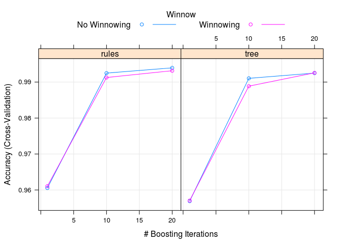

Assignment for Machine Learning Class
================

##### Set the Global options

##### Install the following Packages if not already installed

    {r packages , message=FALSE
    #install.packages("C50")
    #install.packages("pROC")
    #install.packages("doParallel")
    }

##### Packages used

``` r
library(caret)
library(ggplot2)
library(C50)
library(rattle)
library(rpart.plot)
library(rpart)
library(rattle)
library(parallel)
library(doParallel)
```

### Background

Using devices such as Jawbone Up, Nike FuelBand, and Fitbit it is now possible to collect a large amount of data about personal activity relatively inexpensively. These type of devices are part of the quantified self movement – a group of enthusiasts who take measurements about themselves regularly to improve their health, to find patterns in their behavior, or because they are tech geeks. One thing that people regularly do is quantify how much of a particular activity they do, but they rarely quantify how well they do it. In this project, your goal will be to use data from accelerometers on the belt, forearm, arm, and dumbell of 6 participants. They were asked to perform barbell lifts correctly and incorrectly in 5 different ways

### [Analysis](http://groupware.les.inf.puc-rio.br/har)

Six young health participants were asked to perform one set of 10 repetitions of the Unilateral Dumbbell Biceps Curl in five different fashions:

1.  exactly according to the specification (Class A),

2.  throwing the elbows to the front (Class B),

3.  lifting the dumbbell only halfway (Class C),

4.  lowering the dumbbell only halfway (Class D)

5.  and throwing the hips to the front (Class E).

### Data processing and Exploring:

The data for this assignment come in the form of a comma-separated-value file. It is downloaded from the web site:

-   [Training Data](https://d396qusza40orc.cloudfront.net/predmachlearn/pml-training.csv).
-   [Testing Data](https://d396qusza40orc.cloudfront.net/predmachlearn/pml-testing.csv).

Some documentation is also available:

-   The data for this project come from this source [More Information](http://groupware.les.inf.puc-rio.br/har)

Downloading and preparing the data

``` r
#Url link as provided
trainfileurl <- "https://d396qusza40orc.cloudfront.net/predmachlearn/pml-training.csv"

downloadedtrainfile <- "pml-training.csv"
#We only download the file once
if (!file.exists(downloadedtrainfile)) {
  download.file(url = trainfileurl, destfile = downloadedtrainfile)
}

#Url link as provided
testfileurl <- "https://d396qusza40orc.cloudfront.net/predmachlearn/pml-testing.csv"

downloadedtestfile <- "pml-testing.csv"
#We only download the file once
if (!file.exists(downloadedtestfile)) {
  download.file(url = testfileurl, destfile = downloadedtestfile)
}

#Replace the "" values with NA's when loading the data
#Creating the dataset and do some cleaning, 1. Replace the "" values with NA's when loading the data
exercisedata <- read.csv(file = "pml-training.csv" , na.strings = c("", "NA") , stringsAsFactors = FALSE)
exercisetestdata <- read.csv(file = "pml-testing.csv" , na.strings = c("", "NA") , stringsAsFactors = FALSE)

dim(exercisedata)
```

    ## [1] 19622   160

We have 160 variables and we need to clean the features from the the prediction model in order to not overfit our data

A Testing data set is provided ("pml-testing.csv") so we will create a control set from the 'exercisedata' data. We remove some of the variables that is obvious not part of the predictor variables.

``` r
# Preprocessing, get rid of NA, First 7 Columns we ignore and will be removed, also exclude last feature ('classe')
exercisedata[,7:159] <- sapply(exercisedata[,7:159],as.numeric) 
exercisetestdata[,7:159] <- sapply(exercisetestdata[,7:159], as.numeric) 

exercisedata <- exercisedata[8:160]
exercisetestdata <- exercisetestdata[8:160]

#summary(exercisedata)

# remove features that contains NAs in test set as we have 160 features, 
nas <- is.na(apply(exercisetestdata,2,sum))

exercisedata <- exercisedata[,!nas]
exercisetestdata<-exercisetestdata[,!nas]

#Make sure 'classe' is a factor type
exercisedata$classe <- as.factor(exercisedata$classe)
```

### Building the Model

We start with a basic model and partition the training dataset to do a cross validation on the model.

Read more: <http://groupware.les.inf.puc-rio.br/har#ixzz45yV8Ofz2>

``` r
inTrain <- createDataPartition(y=exercisedata$classe, p=0.7, list=FALSE)
traindata <- exercisedata[inTrain,]
#Create the cross validation Data set
crossvaldata <- exercisedata[-inTrain,]

#Description of the Variables
data.frame(exercisedata = dim(exercisedata), traindata = dim(traindata), 
           crossvaldata= dim(crossvaldata), row.names = c("rows", "columns"))
```

    ##         exercisedata traindata crossvaldata
    ## rows           19622     13737         5885
    ## columns           53        53           53

#### Train the first Model

``` r
set.seed(123)
#Regression Model
modelfitstart <- train(classe ~ .,method="rpart",data=traindata)
modelfitstart
```

    ## CART 
    ## 
    ## 13737 samples
    ##    52 predictors
    ##     5 classes: 'A', 'B', 'C', 'D', 'E' 
    ## 
    ## No pre-processing
    ## Resampling: Bootstrapped (25 reps) 
    ## Summary of sample sizes: 13737, 13737, 13737, 13737, 13737, 13737, ... 
    ## Resampling results across tuning parameters:
    ## 
    ##   cp          Accuracy   Kappa     
    ##   0.03987387  0.5022733  0.35279027
    ##   0.05080867  0.4528879  0.26933502
    ##   0.11362018  0.3369890  0.07869399
    ## 
    ## Accuracy was used to select the optimal model using  the largest value.
    ## The final value used for the model was cp = 0.03987387.

#### Cross Validation of the First Model

``` r
#Cross vallidation Data
predictmodel1 <- predict(modelfitstart,crossvaldata)

confmatrix <- confusionMatrix(predictmodel1,crossvaldata$classe, 
                              dnn = c("Actual Classe", "Predicted Classe"))
confmatrix
```

    ## Confusion Matrix and Statistics
    ## 
    ##              Predicted Classe
    ## Actual Classe    A    B    C    D    E
    ##             A 1516  477  503  422  157
    ##             B   20  288   14  157   52
    ##             C  134  374  509  385  369
    ##             D    0    0    0    0    0
    ##             E    4    0    0    0  504
    ## 
    ## Overall Statistics
    ##                                           
    ##                Accuracy : 0.4787          
    ##                  95% CI : (0.4658, 0.4915)
    ##     No Information Rate : 0.2845          
    ##     P-Value [Acc > NIR] : < 2.2e-16       
    ##                                           
    ##                   Kappa : 0.319           
    ##  Mcnemar's Test P-Value : NA              
    ## 
    ## Statistics by Class:
    ## 
    ##                      Class: A Class: B Class: C Class: D Class: E
    ## Sensitivity            0.9056  0.25285  0.49610   0.0000  0.46580
    ## Specificity            0.6298  0.94880  0.74028   1.0000  0.99917
    ## Pos Pred Value         0.4930  0.54237  0.28741      NaN  0.99213
    ## Neg Pred Value         0.9438  0.84105  0.87433   0.8362  0.89251
    ## Prevalence             0.2845  0.19354  0.17434   0.1638  0.18386
    ## Detection Rate         0.2576  0.04894  0.08649   0.0000  0.08564
    ## Detection Prevalence   0.5225  0.09023  0.30093   0.0000  0.08632
    ## Balanced Accuracy      0.7677  0.60083  0.61819   0.5000  0.73249

``` r
fancyRpartPlot(modelfitstart$finalModel)
```


From the data provided by the cross validation we conclude that the model is not accurate enough and we have to try an alternative. It is noted in the following [link](https://github.com/lgreski/datasciencectacontent/blob/master/markdown/pml-requiredModelAccuracy.md) that at least a 99% accuracy will be required to predict all 20 Case. For the next model we will use a "Random forest" model. It is also noted in the following [link](https://github.com/lgreski/datasciencectacontent/blob/master/markdown/pml-randomForestPerformance.md) that performance will be an issue and we therefore will use the "Parallel Package" to speed up the calculation and training of the Model.

### Random Forest Model will parallel processing

``` r
set.seed(123)
#On Linux machine use parallel processing to improve performance
cluster <- makeCluster(detectCores()-1) # convention to leave 1 core for OS
registerDoParallel(cluster)

fitControl <- trainControl(method = "cv", number = 10, allowParallel = TRUE)

improvedModelFit <- train(classe ~ ., data = traindata, method = "C5.0",trControl = fitControl)
```

#### Cross validation

``` r
#Do cross validation with remaining raw data
modelpredict <- predict(improvedModelFit,crossvaldata)

print(improvedModelFit)
```

    ## C5.0 
    ## 
    ## 13737 samples
    ##    52 predictors
    ##     5 classes: 'A', 'B', 'C', 'D', 'E' 
    ## 
    ## No pre-processing
    ## Resampling: Cross-Validated (10 fold) 
    ## Summary of sample sizes: 12362, 12363, 12363, 12362, 12363, 12364, ... 
    ## Resampling results across tuning parameters:
    ## 
    ##   model  winnow  trials  Accuracy   Kappa    
    ##   rules  FALSE    1      0.9605409  0.9501008
    ##   rules  FALSE   10      0.9925016  0.9905154
    ##   rules  FALSE   20      0.9939576  0.9923569
    ##   rules   TRUE    1      0.9610518  0.9507567
    ##   rules   TRUE   10      0.9912649  0.9889509
    ##   rules   TRUE   20      0.9931580  0.9913451
    ##   tree   FALSE    1      0.9569026  0.9455075
    ##   tree   FALSE   10      0.9910467  0.9886750
    ##   tree   FALSE   20      0.9925019  0.9905162
    ##   tree    TRUE    1      0.9570486  0.9456898
    ##   tree    TRUE   10      0.9888634  0.9859133
    ##   tree    TRUE   20      0.9925757  0.9906087
    ## 
    ## Accuracy was used to select the optimal model using  the largest value.
    ## The final values used for the model were trials = 20, model = rules
    ##  and winnow = FALSE.

``` r
plot(improvedModelFit)
```



``` r
#plot(improvedModelFit,plotType = "level")
plot(varImp(improvedModelFit), top = 10)
```


``` r
resampleHist((improvedModelFit))
```


``` r
#Stop parallel processing
stopCluster(cluster)
```

#### Confusion Matrix for Model 2

``` r
#Statistics from confusion matrix

confmatrix2 <- confusionMatrix(modelpredict,crossvaldata$classe, dnn = c("Actual Classe", "Predicted Classe"))
confmatrix2
```

    ## Confusion Matrix and Statistics
    ## 
    ##              Predicted Classe
    ## Actual Classe    A    B    C    D    E
    ##             A 1672    3    0    0    0
    ##             B    1 1134    3    1    0
    ##             C    1    2 1018    0    0
    ##             D    0    0    5  962    1
    ##             E    0    0    0    1 1081
    ## 
    ## Overall Statistics
    ##                                           
    ##                Accuracy : 0.9969          
    ##                  95% CI : (0.9952, 0.9982)
    ##     No Information Rate : 0.2845          
    ##     P-Value [Acc > NIR] : < 2.2e-16       
    ##                                           
    ##                   Kappa : 0.9961          
    ##  Mcnemar's Test P-Value : NA              
    ## 
    ## Statistics by Class:
    ## 
    ##                      Class: A Class: B Class: C Class: D Class: E
    ## Sensitivity            0.9988   0.9956   0.9922   0.9979   0.9991
    ## Specificity            0.9993   0.9989   0.9994   0.9988   0.9998
    ## Pos Pred Value         0.9982   0.9956   0.9971   0.9938   0.9991
    ## Neg Pred Value         0.9995   0.9989   0.9984   0.9996   0.9998
    ## Prevalence             0.2845   0.1935   0.1743   0.1638   0.1839
    ## Detection Rate         0.2841   0.1927   0.1730   0.1635   0.1837
    ## Detection Prevalence   0.2846   0.1935   0.1735   0.1645   0.1839
    ## Balanced Accuracy      0.9990   0.9973   0.9958   0.9984   0.9994

### Results from Model 2

The Kappa value is 0.9961 and Accuracy is now 0.9969, Therefor it appears that we have a good model.

We apply the Model to the Testing set to predict the 20 cases

``` r
#Apply ML Algorithm to Test DataSet
data_test <- read.csv(file = "pml-testing.csv" , na.strings = c("", "NA") , stringsAsFactors = FALSE)

predicted_outcome <- predict(improvedModelFit,data_test)
final_predictions <- data.frame(problem_id = data_test$problem_id, classe = predicted_outcome)

#Final prediction on Test set :
  
  final_predictions
```

    ##    problem_id classe
    ## 1           1      B
    ## 2           2      A
    ## 3           3      B
    ## 4           4      A
    ## 5           5      A
    ## 6           6      E
    ## 7           7      D
    ## 8           8      B
    ## 9           9      A
    ## 10         10      A
    ## 11         11      B
    ## 12         12      C
    ## 13         13      B
    ## 14         14      A
    ## 15         15      E
    ## 16         16      E
    ## 17         17      A
    ## 18         18      B
    ## 19         19      B
    ## 20         20      B

### References

[Link to paper](http://groupware.les.inf.puc-rio.br/work.jsf?p1=11201) <http://groupware.les.inf.puc-rio.br/work.jsf?p1=11201>

[Link to Tutorials](https://www.r-project.org/nosvn/conferences/useR-2013/Tutorials/kuhn/user_caret_2up.pdf)<https://www.r-project.org/nosvn/conferences/useR-2013/Tutorials/kuhn/user_caret_2up.pdf>
